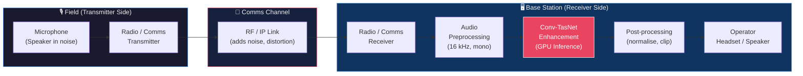
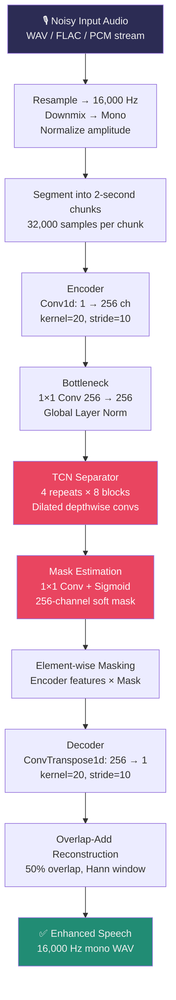
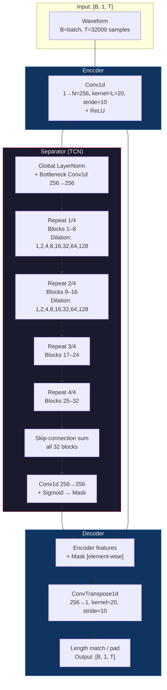
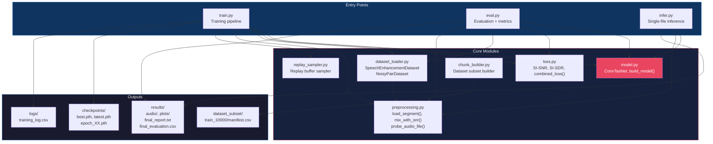
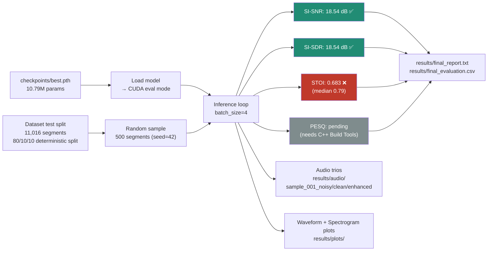
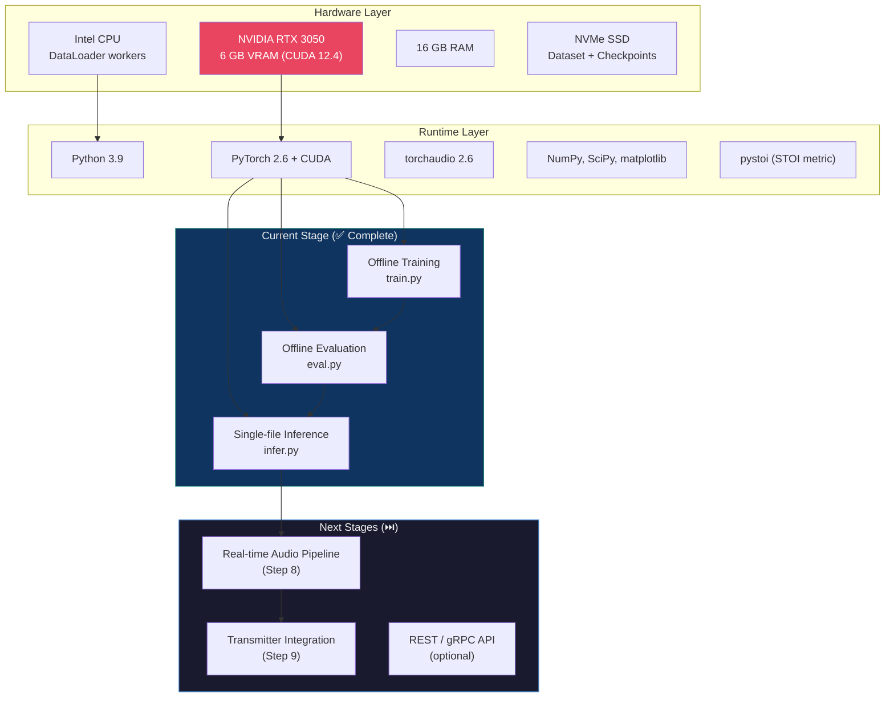
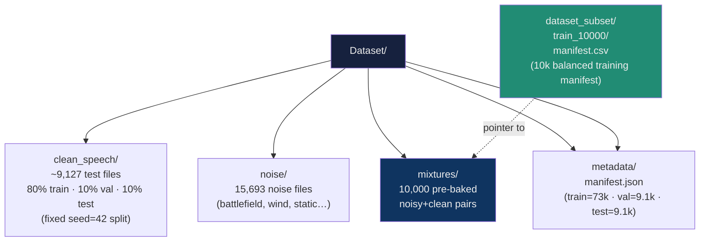
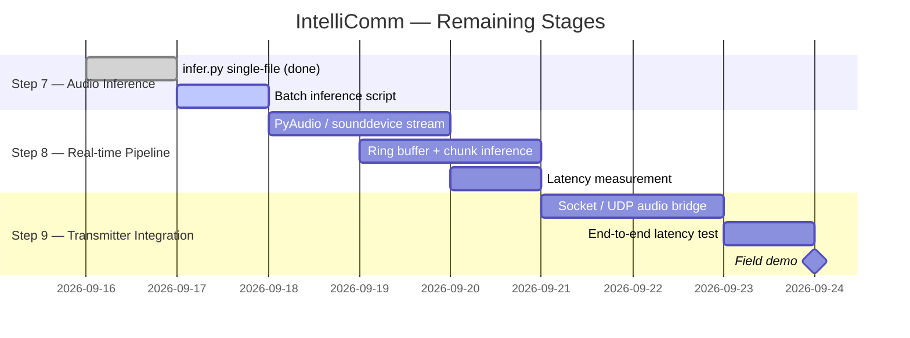

# IntelliComm — System Architecture

**AI-Based Speech Enhancement for Military / Field Communication**
`Version 1.0 | Stage 6 of 9`

---

## 1. System Overview

IntelliComm is a real-time, waveform-domain speech enhancement system built around a **Conv-TasNet** deep neural network. It operates on the **receiver side** of a communication link: noisy incoming audio is enhanced before being heard by the operator.



---

## 2. Full Pipeline — Data Flow



---

## 3. Conv-TasNet Architecture Detail



### Model Hyperparameters

| Symbol | Parameter | Value |
|:---:|:---|:---:|
| **N** | Encoder channels | 256 |
| **L** | Encoder kernel size | 20 (1.25 ms) |
| **B** | TCN bottleneck channels | 256 |
| **H** | TCN hidden (depthwise) channels | 512 |
| **P** | TCN depthwise kernel size | 3 |
| **X** | Conv blocks per TCN repeat | 8 |
| **R** | TCN repeats | 4 |
| — | **Total parameters** | **10,792,000** |
| — | Receptive field | ~1.3 s |
| — | Sample rate | 16,000 Hz |
| — | Segment length | 2.0 s (32,000 samples) |

---

## 4. Software Component Map



---

## 5. Training Pipeline

```mermaid
sequenceDiagram
    participant DS as Dataset (10k samples)
    participant DL as DataLoader
    participant MD as Conv-TasNet Model
    participant LF as Loss (SI-SNR + L1)
    participant OPT as AdamW + AMP
    participant SCH as CosineAnnealingWarmRestarts
    participant CK as Checkpoint

    loop Each Epoch (30 total)
        DS->>DL: Shuffle + batch (B=2)
        DL->>MD: noisy [2,1,32000] → CUDA
        MD->>LF: enhanced [2,1,32000]
        LF->>OPT: combined_loss (SI-SNR + 0.1×L1)
        OPT->>MD: backward + grad clip (norm=5.0)
        OPT->>SCH: step()
        MD->>CK: save latest.pth + epoch_XX.pth
        Note over CK: If val_loss improved → best.pth
    end
```

---

## 6. Evaluation Pipeline



---

## 7. Deployment Architecture (Target)



---

## 8. Dataset Structure



---

## 9. Key Design Decisions

| Decision | Choice | Rationale |
|:---|:---|:---|
| **Model domain** | Waveform (time-domain) | No STFT required; lower latency than TF-masking |
| **Architecture** | Conv-TasNet | State-of-art for single-channel SE; compact (10.7M params) |
| **Loss function** | SI-SNR + 0.1 × L1 | Scale-invariant; L1 regularises waveform amplitude |
| **Precision** | AMP (fp16 + fp32) | 30–40% speedup on RTX 3050; no quality loss |
| **Segmentation** | 2 s / 32,000 samples | Fits 6 GB VRAM at batch=2; good temporal context |
| **Overlap-add** | 50% hop, Hann window | Smooth reconstruction of long audio in inference |
| **Split strategy** | 80/10/10 file-level (seed=42) | Prevents speaker leakage across splits |
| **Training data** | 10,000 balanced samples | Memory / time budget for RTX 3050 laptop GPU |

---

## 10. Performance Achieved

| Metric | Value | Target | Status |
|:---|:---|:---|:---|
| SI-SNR (test) | **18.54 dB** | > 15.0 dB | ✅ PASS |
| SI-SDR (test) | **18.54 dB** | — | ✅ |
| STOI (test, avg) | **0.683** | > 0.85 | ❌ (median 0.79) |
| PESQ | Pending | > 2.5 | ⚠️ |
| Parameters | 10.79 M | — | Compact |
| Inference speed | ~4 samples/s (batch=4) | Real-time target → Step 8 | ⏭️ |
| VRAM usage | ~173 MB | < 6 GB | ✅ |

---

## 11. Next Steps (Steps 7–9)


